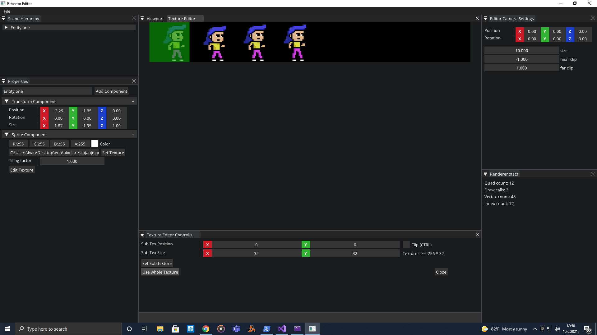
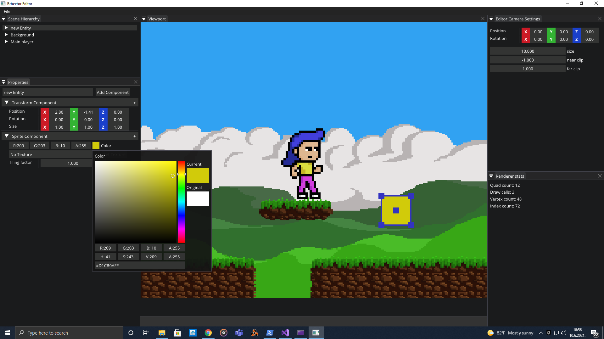
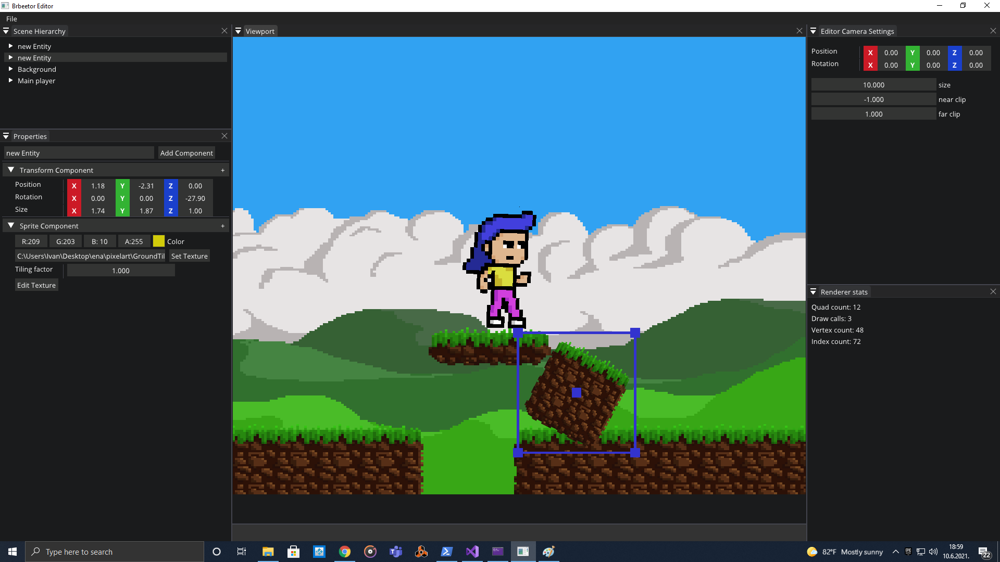
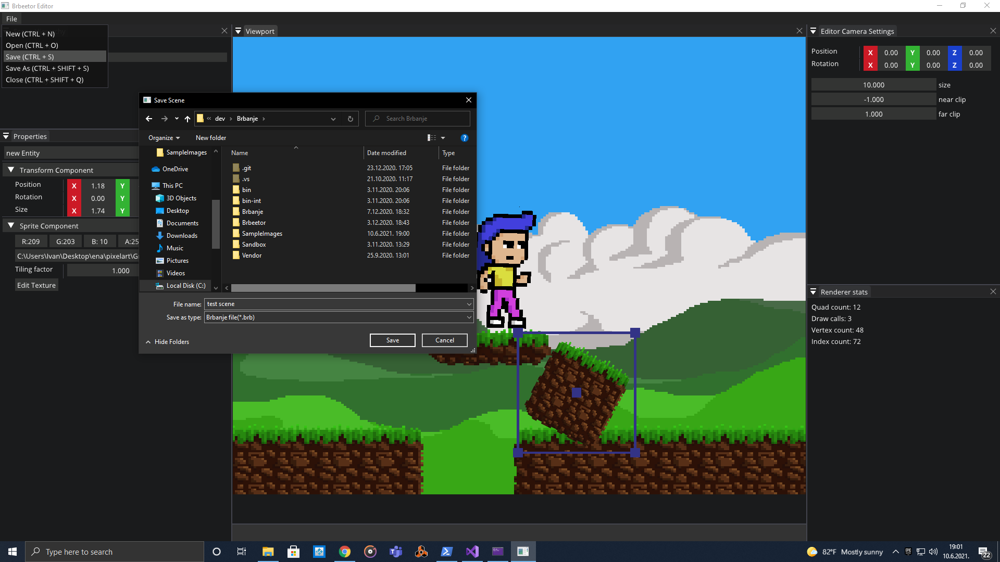

# Brbanje

Brbanje is 2D game engine which is currently powered by OpenGl.


## Description

Brbanje is my game engine learning project. After learning about OpenGl, I started developing my own game engine inspired by Chernos Hazel project.

Currently engine is able to render 2D graphics which are batched together to optimize rendering speed.
It can render 3D, but it is still work in progress.

All rendering classes are abstracted so in future it could be powered by DirectX, Vulkan etc..

Inside Brbanje project there is Brbeetor game editor in which user can create, save and load game scenes.

# Images







### Dependencies

* Currently works only on Windows
* Visual studio 2017 or 2019


## Installing

* Clone this repository:
```
https://github.com/Rustifan/Brbanje.git
```
* enter Brbanje folder
```
cd .\Brbanje
```
* run generateSolution.bat
```
.\generateSolution.bat
```
* Run Brbanje.sln in Visual studio
* Set Brbeetor as starting project
* Compile and run project

